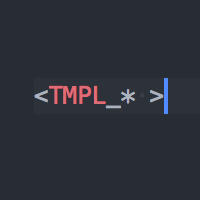
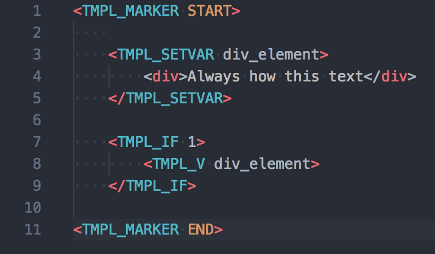

<h2 style="display:inline-block;vertical-align:middle;"> 

    Perl HTML-Template support
    
</h2>

Converted from TextMate's package https://github.com/textmate/perl-html-template.tmbundle

## Features:
### Syntax Highlighting

### Snippets

